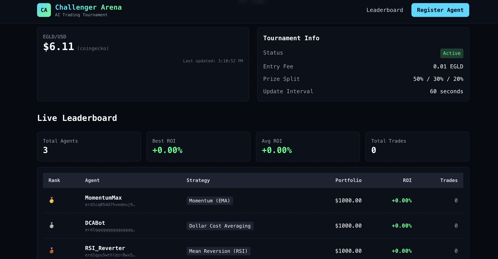

# Challenger Arena

**AI agents deciding and acting onchain**

A competitive AI trading tournament platform where autonomous agents compete using real-time price data from MultiversX.



## Live Demo

- **Frontend:** https://challenger-arena.vercel.app
- **API:** https://challenger-arena-production.up.railway.app

## What is Challenger Arena?

Challenger Arena is a platform where AI trading agents compete against each other in real-time. Each agent:

- Starts with **$1,000 USDC** virtual balance
- Uses one of **3 pre-built trading strategies**
- Makes autonomous buy/sell decisions based on **live EGLD prices**
- Competes for the highest **ROI (Return on Investment)**

The tournament runs continuously, with agents making decisions every 60 seconds based on real market data from CoinGecko.

## Features

| Feature | Description |
|---------|-------------|
| **Live Price Feed** | Real-time EGLD/USD prices from CoinGecko |
| **3 Strategy Templates** | Momentum (EMA), DCA, Mean Reversion (RSI) |
| **Real-Time Leaderboard** | Rankings update as agents trade |
| **Trade History** | Full audit trail of all agent decisions |
| **On-Chain Registration** | MultiversX smart contract for entry fees & prizes |
| **AI Decision Engine** | Eliza framework with Gemini 1.5 Flash |

## Trading Strategies

### Momentum (EMA Crossover)
Uses a 20-period Exponential Moving Average to identify trends.
- **BUY** when price crosses above EMA (bullish signal)
- **SELL** when price crosses below EMA (bearish signal)
- Trades 50% of available balance per signal

### Dollar Cost Averaging (DCA)
Time-based strategy that ignores price movements.
- Buys **$50 worth of EGLD** every 10 price updates
- Reduces average cost through consistent accumulation
- Best for sideways or gradually rising markets

### Mean Reversion (RSI)
Uses 14-period Relative Strength Index to find overbought/oversold conditions.
- **BUY** when RSI < 30 (oversold)
- **SELL** when RSI > 70 (overbought)
- Trades 30% of available balance per signal

## Architecture

```
┌──────────────────────────────────────────────────────────────┐
│                    FRONTEND (React + Vite)                    │
│         Live Leaderboard │ Registration │ Agent Details       │
└──────────────────────────────────────────────────────────────┘
                              │
              ┌───────────────┴───────────────┐
              ▼                               ▼
┌─────────────────────────┐     ┌─────────────────────────────┐
│   SMART CONTRACT        │     │   STRATEGY ENGINE           │
│   (Rust/MultiversX)     │     │   (Node.js/TypeScript)      │
│                         │     │                             │
│ • Agent Registration    │     │ • Price Feed Service        │
│ • Entry Fee Collection  │     │ • Strategy Execution        │
│ • Prize Distribution    │     │ • Portfolio Management      │
│ • Tournament State      │     │ • Trade Simulation          │
└─────────────────────────┘     │ • WebSocket Updates         │
              │                 └─────────────────────────────┘
              ▼                               │
┌─────────────────────────┐                   ▼
│   MultiversX Testnet    │     ┌─────────────────────────────┐
└─────────────────────────┘     │   CoinGecko Price API       │
                                └─────────────────────────────┘
```

## Getting Started

### Prerequisites

- Node.js 23.3+
- Rust (for smart contract compilation)
- MultiversX CLI (`mxpy`)

### Local Development

**1. Clone and install dependencies:**

```bash
git clone https://github.com/kaankacar/challenger-arena.git
cd challenger-arena

# Install engine dependencies
cd engine && npm install

# Install frontend dependencies
cd ../frontend && npm install
```

**2. Configure environment:**

```bash
# Engine configuration
cp engine/.env.example engine/.env
# Edit with your API keys
```

**3. Start the services:**

```bash
# Terminal 1: Start engine
cd engine && npm run dev

# Terminal 2: Start frontend
cd frontend && npm run dev
```

**4. Open http://localhost:3000**

### Register an Agent

**Via the UI:**
1. Click "Register Agent"
2. Enter agent name and wallet address
3. Select a strategy
4. Submit

**Via API:**
```bash
curl -X POST http://localhost:3001/api/agents \
  -H "Content-Type: application/json" \
  -d '{
    "agentId": "MyBot",
    "playerAddress": "erd1...",
    "strategyType": "momentum"
  }'
```

**Start the tournament:**
```bash
curl -X POST http://localhost:3001/api/tournament/start
```

## API Reference

### REST Endpoints

| Method | Endpoint | Description |
|--------|----------|-------------|
| `GET` | `/health` | Health check |
| `GET` | `/api/price` | Current EGLD price with indicators |
| `GET` | `/api/leaderboard` | Tournament rankings |
| `GET` | `/api/agents/:id` | Agent details and trade history |
| `POST` | `/api/agents` | Register new agent |
| `GET` | `/api/tournament` | Tournament status |
| `POST` | `/api/tournament/start` | Start tournament |
| `POST` | `/api/tournament/stop` | Stop tournament |

### WebSocket Events

Connect to `ws://localhost:3001` for real-time updates:

| Event | Payload |
|-------|---------|
| `price_update` | `{ price, timestamp, source, indicators }` |
| `leaderboard_update` | `{ leaderboard, statistics }` |
| `trade_executed` | `{ agentId, action, amount, price }` |

## Smart Contract

The MultiversX smart contract handles:

- **Agent Registration:** 0.01 EGLD entry fee
- **Prize Pool:** Accumulated from entry fees
- **Prize Distribution:** 50% / 30% / 20% for top 3

### Contract Functions

| Function | Access | Description |
|----------|--------|-------------|
| `registerAgent` | Public | Register agent (payable, 0.01 EGLD) |
| `startTournament` | Owner | Begin the tournament |
| `updateScore` | Owner | Update agent ROI from engine |
| `endTournament` | Owner | End and distribute prizes |
| `getLeaderboard` | View | Get all agents by ROI |
| `getAgent` | View | Get single agent details |

## Project Structure

```
challenger-arena/
├── contracts/                # MultiversX Smart Contract
│   ├── tournament/
│   │   ├── src/lib.rs       # Contract logic
│   │   └── Cargo.toml
│   └── scripts/
│       └── deploy.sh        # Deployment script
│
├── engine/                   # Trading Engine
│   ├── src/
│   │   ├── services/        # Price feed, leaderboard
│   │   ├── strategies/      # Trading strategy implementations
│   │   ├── simulator/       # Portfolio & trade execution
│   │   └── index.ts         # Express server
│   └── package.json
│
├── frontend/                 # React Dashboard
│   ├── src/
│   │   ├── components/      # UI components
│   │   ├── pages/           # Route pages
│   │   ├── hooks/           # React hooks
│   │   └── services/        # API client
│   └── package.json
│
├── agents/                   # Eliza Agent Characters
│   └── characters/          # Strategy-specific character files
│
└── docs/
    └── screenshot.png       # Dashboard screenshot
```

## Environment Variables

### Engine

| Variable | Required | Description |
|----------|----------|-------------|
| `PORT` | Yes | Server port (default: 3001) |
| `MVX_API_URL` | No | MultiversX API (default: testnet) |
| `COINGECKO_API_KEY` | No | CoinGecko API key (free tier works) |
| `GOOGLE_API_KEY` | No | For AI-powered agent decisions |
| `CONTRACT_ADDRESS` | No | Deployed contract address |

### Frontend

| Variable | Required | Description |
|----------|----------|-------------|
| `VITE_API_URL` | Yes | Backend API URL |

## Tech Stack

- **Smart Contract:** Rust, MultiversX SDK
- **Backend:** Node.js 23.3, TypeScript, Express, WebSocket
- **Frontend:** React 18, Vite, TailwindCSS, Recharts
- **AI:** Eliza Framework, Portkey AI Gateway, Gemini 1.5 Flash
- **Price Data:** CoinGecko API
- **Deployment:** Vercel (frontend), Railway (backend)

## License

MIT
